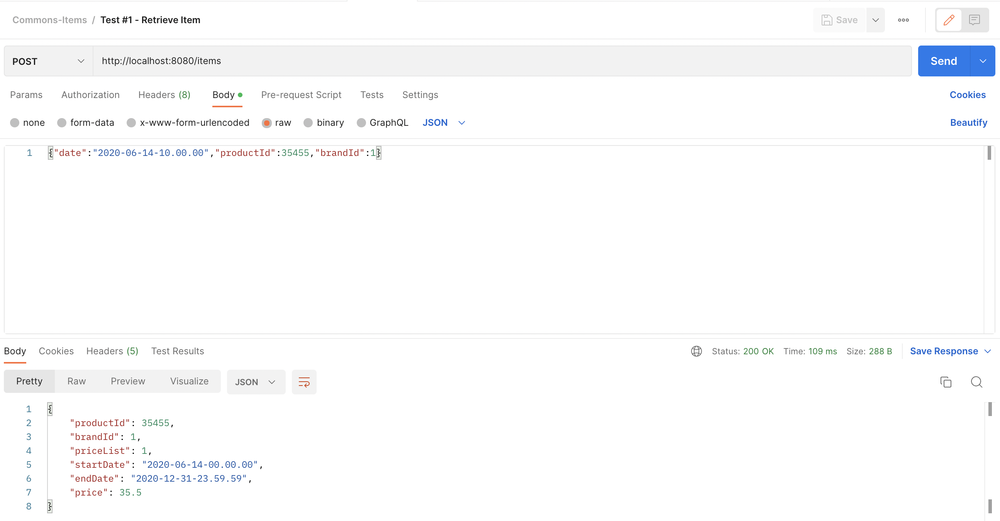
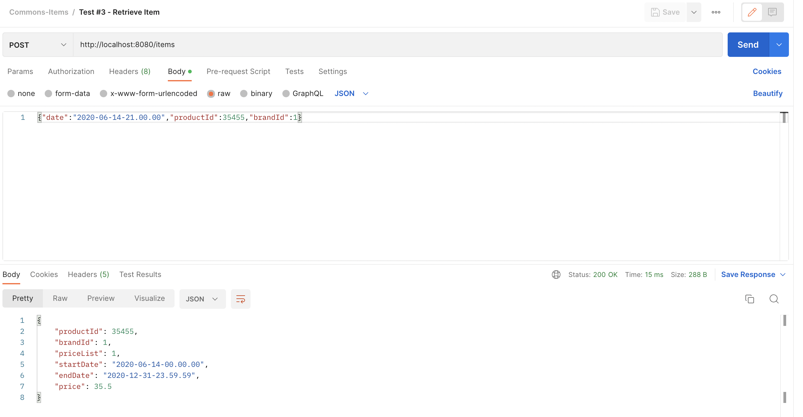
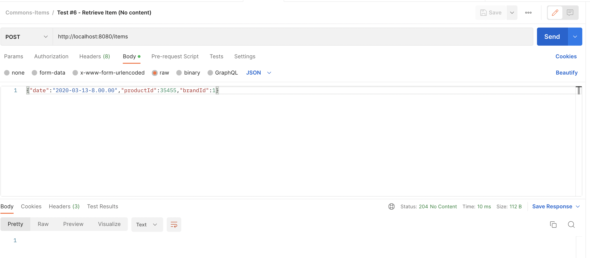

<h1 align="center"> Commons: Items Microservice </h1> <br>


## How to import this project on IntelliJ

Go to `File` > `Open...` > (navigate to `pom.xml`) > `Open` > `Open as Project` > check `Use auto-import` > `Ok` > voilà!

## Java Compiler Version

This microservice has been implemented under Java 17.

## Specs

En la base de datos de comercio electrónico de la compañía disponemos de la tabla PRICES que refleja el 
precio final (pvp) y la tarifa que aplica a un producto de una cadena entre unas fechas determinadas. 
A continuación se muestra un ejemplo de la tabla con los campos relevantes:

```PRICES
-------

BRAND_ID         START_DATE                                    END_DATE                        PRICE_LIST                   PRODUCT_ID  PRIORITY                 PRICE           CURR
------------------------------------------------------------------------------------------------------------------------------------------------------------------------------------------------------------------------------------------
1         2020-06-14-00.00.00                        2020-12-31-23.59.59                        1                        35455                0                        35.50            EUR
1         2020-06-14-15.00.00                        2020-06-14-18.30.00                        2                        35455                1                        25.45            EUR
1         2020-06-15-00.00.00                        2020-06-15-11.00.00                        3                        35455                1                        30.50            EUR
1         2020-06-15-16.00.00                        2020-12-31-23.59.59                        4                        35455                1                        38.95            EUR
```
Campos:

* **BRAND_ID**: foreign key de la cadena del grupo (1 = ZARA).
* **START_DATE** , **END_DATE**: rango de fechas en el que aplica el precio tarifa indicado.
* **PRICE_LIST**: Identificador de la tarifa de precios aplicable.
* **PRODUCT_ID**: Identificador código de producto.
* **PRIORITY**: Desambiguador de aplicación de precios. Si dos tarifas coinciden en un rago de fechas se aplica la de mayor prioridad (mayor valor numérico).
* **PRICE**: precio final de venta.
* **CURR**: iso de la moneda.

Se pide:

Construir una aplicación/servicio en SpringBoot que provea una end point rest de consulta  tal que:

* Acepte como parámetros de entrada: fecha de aplicación, identificador de producto, identificador de cadena.
* Devuelva como datos de salida: identificador de producto, identificador de cadena, tarifa a aplicar, fechas de aplicación y precio final a aplicar.

Se debe utilizar una base de datos en memoria (tipo h2) e inicializar con los datos del ejemplo, 
(se pueden cambiar el nombre de los campos y añdir otros nuevos si se quiere, elegir el tipo de dato que se considere adecuado para los mismos).

Desarrollar unos test al endpoint rest que  validen las siguientes peticiones al servicio con los datos del ejemplo:

-          Test 1: petición a las 10:00 del día 14 del producto 35455 para la brand 1 (ZARA)     EXPECTED OUTPUT: [productId:35455, brandId:1, priceList:1, startDate:2020-06-14-00.00.00, endDate: 2020-12-31-23.59.59, price:35.50]
-          Test 2: petición a las 16:00 del día 14 del producto 35455 para la brand 1 (ZARA)     EXPECTED OUTPUT: [productId:35455, brandId:1, priceList:2, startDate:2020-06-14-15.00.00, endDate: 2020-06-14-18.30.00, price:25.45]
-          Test 3: petición a las 21:00 del día 14 del producto 35455 para la brand 1 (ZARA)     EXPECTED OUTPUT: [productId:35455, brandId:1, priceList:1, startDate:2020-06-14-00.00.00, endDate: 2020-12-31-23.59.59, price:35.50]
-          Test 4: petición a las 10:00 del día 15 del producto 35455 para la brand 1 (ZARA)     EXPECTED OUTPUT: [productId:35455, brandId:1, priceList:3, startDate:2020-06-15-00.00.00, endDate: 2020-06-15-11.00.00, price:30.50]
-          Test 5: petición a las 21:00 del día 16 del producto 35455 para la brand 1 (ZARA)     EXPECTED OUTPUT: [productId:35455, brandId:1, priceList:4, startDate:2020-06-15-16.00.00, endDate: 2020-12-31-23.59.59, price:38.95]
-          ADDED TEST 6: petición a las 8:00 del día 13 del producto 35455 para la brand 1 (ZARA) EXPECTED OUTPUT: OK - No content (meaning there is no matching date)

## Important Notes - Useful Information

* Strict TDD has been applied to create this project.


* Valid dates and further information about items in the database are taken for granted. 
In another words, to avoid adding noise or over-engineering to the problem, no validations are done at ItemResponse 
level. (Thus assuming the data in the table PRICES is always valid.)


* The PostMan collection has been added to the repo under src/main/resources/collections/Commons-Items.postman_collection.json. It contains all use cases:

## Use cases - tests in PostMan:

* Test 1:



* Test 2:


* Test 3:



* Test 4:


* Test 5:


* Test 6:




